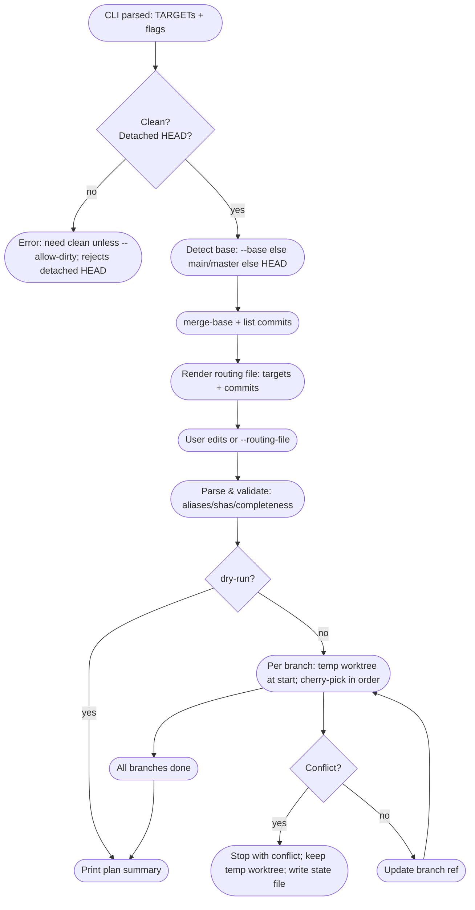

# git-extract Architecture

Developer-facing notes on how the tool works under the hood.

## Flow overview
1) Parse CLI: positional `TARGET ...` merged with `--targets`; flags for `--base`, `--default-current`, `--no-current`, `--editor`, `--dry-run`, `--allow-dirty`, hidden `--routing-file`.
2) Safety gate: reject detached HEAD; require clean worktree unless `--allow-dirty`.
3) Base detection: use `--base` if provided; else try `origin/main`, `main`, `origin/master`, `master`; fallback to `HEAD` (emits note).
4) Commit discovery: compute merge-base of `HEAD` and base; list commits on current branch after merge-base (oldest → newest).
5) Routing file: generate temp file with `target <alias> <branch>` lines and commit lines `current <sha> <subject>`; launch editor (or use `--routing-file`). Editor resolution order: `--editor` > `GIT_SEQUENCE_EDITOR` > `GIT_EDITOR` > `core.editor` > `VISUAL` > `EDITOR` > `vi`.
6) Parse/validate: read edited file; allow comments/blank; update target aliases; ensure every commit is assigned; dest may be alias, branch name, `current`, or dropped when `--no-current`.
7) Apply plan: for each target branch, create a detached temp worktree at base (or existing branch tip), cherry-pick assigned commits in order; on first conflict abort cherry-pick, remove worktree, error out; if all succeed, update `refs/heads/<branch>` to resulting HEAD.
8) Summary: report created branches and commit counts per branch (dry-run prints planned counts only).

## Mermaid diagram

## Key Git workflows
- Commit set: `merge-base(HEAD, base)` then revwalk from HEAD hiding merge-base; preserves order from oldest to newest.
- Branch prep: uses existing branch tip if present; otherwise base commit; branch ref updated only after successful worktree cherry-picks.
- Temp worktrees: `git worktree add --detach <tmp> <start>` isolates changes and avoids touching the user’s working tree.
- Cherry-pick: sequential per branch; on conflict leaves temp worktree, writes state, and waits for `--continue`/`--abort` (auto-chdir to worktree on resume unless `--no-chdir-conflict`).

## Safety and edge cases
- Detached HEAD rejected up front.
- Clean check unless `--allow-dirty`.
- Base fallback: notes when defaulting to `HEAD` because main/master not found.
- Non-UTF8 commit subjects handled via lossy conversion.
- Every listed commit must be assigned; duplicates rejected.

## CLI quick reference
- Positional targets: `git extract feature1 feature2`
- Flags: `--base <branch>`, `--targets a,b` (merged with positional), `--default-current` (no-op; default keep), `--no-current` (drop unassigned), `--editor <cmd>`, `--dry-run`, `--allow-dirty`, `--routing-file <path>` (hidden, automation/tests), `--continue`, `--abort`.
